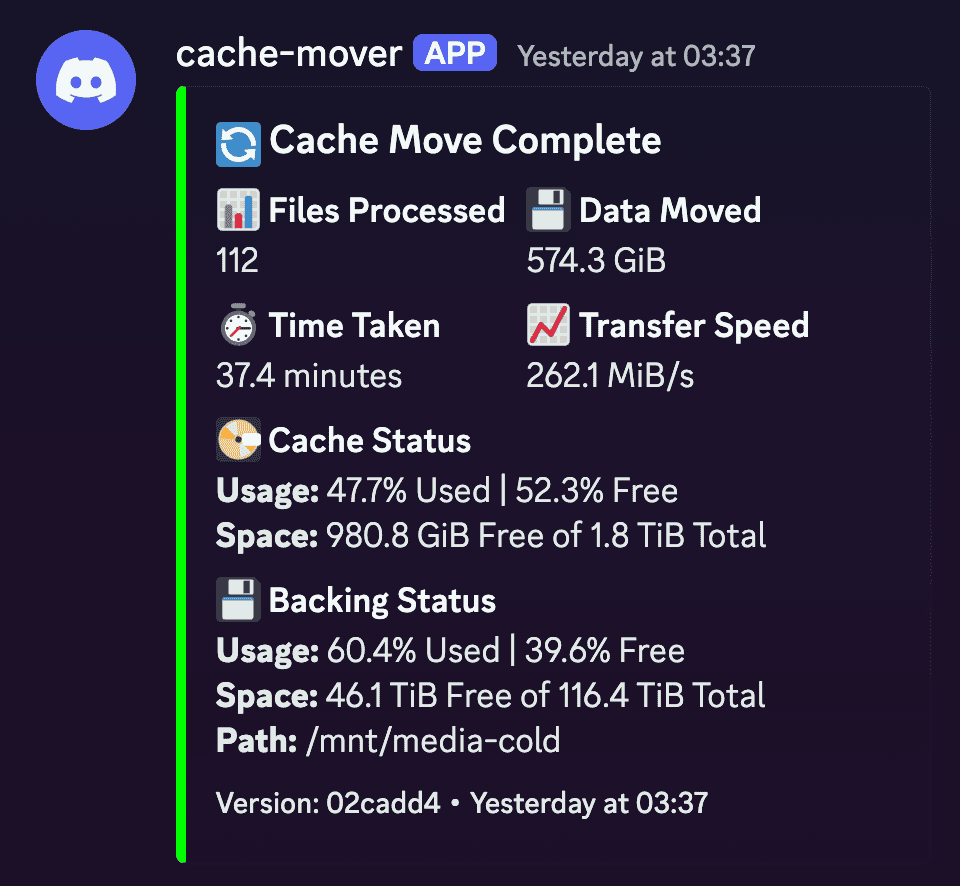
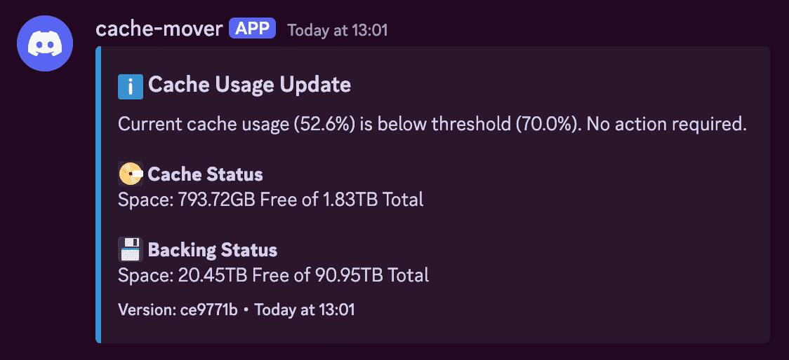

# mergerfs-cache-mover

Python script / Docker container for moving files. Used primarily for moves from a 'cached' location to a backing backing disk pool.

This was created as part of [MANS.](https://github.com/monstermuffin/muffins-awesome-nas-stack/)

## How It Works
The script operates by checking the disk usage of the defined 'cache' directory. If the usage is above the threshold percentage defined in the configuration file (`config.yml`), it will move the oldest files out to the backing storage location until the usage is below a defined target percentage. Empty directories are cleaned after this operation.

The script uses a configuration file or environment variables in Docker to manage settings such as paths, thresholds, and system parameters. 

At runtime, a check for other instances of itself will prevent multiple concurrent operations. In the event a move process is still occurring from a previous run because you are using slow storage, running the script too regularly, or both, the script will not run.

# Usage
## Setup - Host OS (Recommended)
1. To get started, clone the repository to your local machine using the following command:

```shell
git clone https://github.com/MonsterMuffin/mergerfs-cache-mover.git
```

2. Install the required Python packages using pip:

```shell
pip install -r requirements.txt
```

## Configuration Setup
Copy `config.example.yml` to `config.yml` and set up your `config.yml` with the appropriate values:

- `CACHE_PATH`: The path to your cache directory. !!THIS IS YOUR CACHE DISK ROOT, NOT MERGERFS CACHE MOUNT!!
- `BACKING_PATH`: The path to the backing storage where files will be moved.
- `LOG_PATH`: The path for the log file generated by the script.
- `LOG_LEVEL`: The log level to use (e.g., `DEBUG`, `INFO`, `WARNING`, `ERROR`).
- `AUTO_UPDATE`: Allows the script to update itself from GitHub on ever run.
- `THRESHOLD_PERCENTAGE`: The usage percentage of the cache directory that triggers the file-moving process.
- `TARGET_PERCENTAGE`: The target usage percentage to achieve after moving files.
- `MAX_WORKERS`: The maximum number of parallel file-moving operations.
- `MAX_LOG_SIZE_MB`: The maximum size for the log file before it's rotated.
- `BACKUP_COUNT`: The number of backup log files to maintain.
- `NOTIFICATIONS_ENABLED`: Enables notifications (default false)
- `NOTIFICATION_URLS`: Apprise notification URLs
- `NOTIFY_THRESHOLD`: Notify on no action (default false)

> [!WARNING]  
> This script must be run as root (using sudo) for the following reasons:

- **File Permissions**: Running as root ensures the script can read from and write to all directories, preserving original file permissions and ownership.
- **Directory Creation**: Root access is required to create directories with the correct permissions in the destination path.

## Setup - Docker
Docker support was added in v1.0. The container will automatically run on a schedule defined in your configuration. This is a cron scedule.

### Quick Start
```yaml
services:
  cache-mover:
    image: ghcr.io/monstermuffin/mergerfs-cache-mover:latest
    container_name: mergerfs-cache-mover
    environment:
      # Required paths
      CACHE_PATH: /mnt/cache-disks/cache01
      BACKING_PATH: /mnt/media-cold
      # Optional settings with their default values
      SCHEDULE: '0 3 * * *'  # Run at 3 AM daily
      THRESHOLD_PERCENTAGE: 70
      TARGET_PERCENTAGE: 25
      LOG_LEVEL: INFO
      MAX_WORKERS: 8
      EXCLUDED_DIRS: temp,downloads,cache
      NOTIFICATIONS_ENABLED: True
      NOTIFY_THRESHOLD: True
      NOTIFICATION_URLS: "discord://webhook_id/webhook_token,slack://hooks.slack.com/services/YOUR/SLACK/WEBHOOK"
    volumes:
      - /mnt/cache-disks:/mnt/cache-disks:rw
      - /mnt/media-cold:/mnt/media-cold:rw
      - /mnt/data-disks:/mnt/data-disks:rw  # Required for hardlink support, must be the root of your data disks.
      - ./logs:/var/log:rw  # Optional: Mount for persistent logs
    cap_add:
      - SYS_ADMIN
      - DAC_READ_SEARCH
    restart: unless-stopped
```

### Configuration
The container can be configured through environment variables or by mounting a configuration file. All settings available in the 'traditional' setup are supported in Docker.

> [!NOTE]  
> Examples of using environment variables and using a config file are included in `docker-compose.yml`.

### Using Environment Variables
All configuration options can be set via environment variables:

- `CACHE_PATH`: Path to your cache directory (required)
- `BACKING_PATH`: Path to your backing storage (required)
- `SCHEDULE`: Cron expression for scheduling (default: "0 3 * * *")
- `THRESHOLD_PERCENTAGE`: Usage percentage that triggers moves (default: 70)
- `TARGET_PERCENTAGE`: Target usage percentage (default: 25)
- `LOG_LEVEL`: Log level (default: INFO, examples: `DEBUG`, `INFO`, `WARNING`, `ERROR`).
- `MAX_WORKERS`: Maximum parallel file moves (default: 8)
- `EXCLUDED_DIRS`: Comma-separated list of directories to exclude
- `NOTIFICATIONS_ENABLED`: Enables notifications (default false)
- `NOTIFICATION_URLS`: Apprise notification URLs
- `NOTIFY_THRESHOLD`: Notify on no action (default false)

### Using Config File
You can optionally mount a `config.yml` into the container as so:

```yaml
services:
  cache-mover:
    # ... other settings ...
    volumes:
      - ./config.yml:/app/config.yml:ro
```

### Manual Trigger
To manually trigger the cache mover via docker in two ways. If you do not have a running container:

```bash
docker run --rm \
  --name cache-mover-test \
  --privileged \
  -v /mnt/cache-disks:/mnt/cache-disks:rw \
  -v /mnt/media-cold:/mnt/media-cold:rw \
  -v /mnt/data-disks:/mnt/data-disks:rw \
  -e CACHE_PATH=/mnt/cache-disks/cache01 \
  -e BACKING_PATH=/mnt/media-cold \
  -e THRESHOLD_PERCENTAGE=0 \
  -e TARGET_PERCENTAGE=0 \
  ghcr.io/monstermuffin/mergerfs-cache-mover:latest \
  python cache-mover.py --console-log
```

Or with an existing running container bypassing cron:
```bash
docker exec mergerfs-cache-mover python cache-mover.py --console-log
```

### Important Notes
1. **Graceful Shutdown**: The container includes graceful shutdown handling. This ensures that any in-progress file moves complete safely when the container is stopped. If you try and quit the container forcefully during a move, you may incur data corruption.

2. **Permissions**: The container requires to be run with privileged mode to access and modify file permissions correctly, same as the script method.

3. **Volume Mounts**: Ensure your volume mounts match the paths specified in your configuration.

4. **Auto-Update**: Auto-update is disabled by default in Docker to maintain container immutability. Use container image updates instead with something like [Watchtower](https://github.com/containrrr/watchtower) or [Duin](https://github.com/crazy-max/diun).

### Logging in Docker
When running in Docker, logs are written to a file on the host system via a bind mount. The log file is capped at 100MB and will be truncated when it exceeds this size.

By default, logs are written to `/var/log/cache-mover.log`. You can change this by modifying the volume mount in your `docker-compose.yml`:

```yaml
volumes:
  - /var/log/cache-mover.log:/var/log/cache-mover.log:rw
```

You can also view the logs with the usual: 
```bash
docker logs mergerfs-cache-mover
```

### Hardlink Support in Docker
For hardlink preservation to work properly, you must mount both:
- The mergerfs pool paths (cache and backing).
- The underlying physical disk path(s), this should just be `/mnt/data-disks/` if using MANS.

## Logging
The script logs its operations, which includes information on moved files, errors, and other warnings. The logs are rotated based on the file size and backup count defined in config.yml.

Docker logs are shown in console at runtime, and also as a file on the host if you bind mount, as below.

## Notifications
As of v1.1 support for various notification methods through was added via the Apprise library. This includes detailed notifications for script completion, threshold alerts, and error states.

### Configuration
Notifications can be enabled through your `config.yml` or environment variables:

```yaml
Settings:
  NOTIFICATIONS_ENABLED: true
  NOTIFICATION_URLS:
    - 'discord://webhook_id/webhook_token'
    - 'slack://hooks.slack.com/services/YOUR/SLACK/WEBHOOK'
  NOTIFY_THRESHOLD: true  # Whether to notify when threshold is not met
```

Or via Docker environment variables:

```yaml
environment:
  - NOTIFICATIONS_ENABLED: true
  - NOTIFICATION_URLS: discord://webhook_id/webhook_token,slack://hooks.slack.com/services/YOUR/SLACK/WEBHOOK  
  - NOTIFY_THRESHOLD: true
```

### Supported Services
Currently, the script provides rich formatting support for:
- **Discord**: Full embed support with detailed statistics.
- **Slack**: Rich message formatting with detailed statistics.

And basic support for:
- **Other Services**: Basic notification support through Apprise.

To see how to configure your service, please see the [Approise docs.](https://github.com/caronc/apprise#productivity-based-notifications)

> [!NOTE]
> I have not tested anything but Discord/Slack webhooks at the time of writing. If you would like rich formatting for a specific service, feel free to raise an issue or PR.



### Threshold Notification
`NOTIFY_THRESHOLD` enables sending a notification when a run was started, but no action was taken due to `THRESHOLD_PERCENTAGE` not being reached. If this is not defined it is defaulted to `false`.

> [!NOTE]
> Notifications are not sent if the script is run with `--dry-run` regardless of the `NOTIFY_THRESHOLD` setting.


### Notification Types

1. **Completion Notification**
   - Sent when files are successfully moved
   - Includes:
     - Number of files processed
     - Total data moved
     - Operation duration
     - Transfer speed
     - Cache and backing storage status

2. **Threshold Not Met**
   - Sent when cache usage is below threshold
   - Includes:
     - Current cache usage
     - Threshold percentage
     - Cache and backing storage status

3. **Error Notification**
   - Sent when script encounters errors
   - Includes detailed error messages

### Service-Specific Setup

#### Slack
For Slack notifications, you'll need to create an incoming webhook. Use the full webhook URL:

```yaml
NOTIFICATION_URLS:
  - 'https://hooks.slack.com/services/T1234/B5678/abcdef123456'
```

> [!NOTE]  
> For Slack, format the webhook as in the `config.example.yml`.

#### Discord
For Discord notifications, use your webhook URL in this format:

```yaml
NOTIFICATION_URLS:
  - 'discord://webhook_id/webhook_token'
```

> [!NOTE]  
> Get your webhook URL from Discord Channel Settings → Integrations → Webhooks.

### Additional Services
For additional notification services and their configuration, refer to the [Apprise Documentation](https://github.com/caronc/apprise#productivity-based-notifications).

## Usage
To run the script manually, use the following command from your terminal:

```shell
sudo python3 cache-mover.py --console-log
```

You can also specify `--dry-run`

```shell
sudo python3 cache-mover.py --dry-run --console-log
```

### Custom Configuration File Location
By default, the script looks for `config.yml` in the same directory. You can specify a custom configuration file location using the `--config` option:

```shell
sudo python3 cache-mover.py --config /etc/cache-mover/config.yml --console-log
```

## Automated Execution
Use either a `systemd` timer or Crontab entry. I have been moving from crontab to `systemd` timers myself, but you live your life how you see fit.

### Option 1: Systemd Timer
1. Create a `systemd` service file `/etc/systemd/system/cache_mover.service`. Change `/path/to/cache-mover.py` to where you downloaded the script, obviously.

```ini
[Unit]
Description="Muffin's Cache Mover Script."
After=network.target

[Service]
ExecStart=/usr/bin/python3 /opt/mergerfs-cache-mover/cache-mover.py
WorkingDirectory=/opt/mergerfs-cache-mover

[Install]
WantedBy=multi-user.targe
```

2. Create a systemd timer file `/etc/systemd/system/cache_mover.timer`. The timer format is not the usual crontab format, [find out more](https://silentlad.com/systemd-timers-oncalendar-(cron)-format-explained) if you need help.

```ini
[Unit]
Description="Runs Cache Mover Script Daily at 3AM."

[Timer]
OnCalendar=*-*-* 03:00:00
Persistent=true

[Install]
WantedBy=timers.target
```

3. Enable and start the timer:

```shell
systemctl enable cache_mover.timer
systemctl start cache_mover.timer
```

4. Check timer status:

```shell
systemctl list-timers
```

### Option 2: Crontab
1. Open crontab file for editing:

```shell
sudo crontab -e
```

2. Add line to run script. The following example will run the script daily, at 3AM. You can adjust this by using a site such as [crontab.guru.](https://crontab.guru/)
Change `/path/to/cache-mover.py` to where you downloaded the script, obviously.

```cron
0 3 * * * /usr/bin/python3 /path/to/cache-mover.py
```

## Special Features
### Hardlink Support

As of v1.3, the script supports preserving hardlinks when moving files between different filesystems. When files with the same inode (hardlinked files) are detected, they are:

- Grouped together based on inode relationships.
- Moved as a single unit to preserve their relationships.
- Recreated with proper hardlink structure on the destination filesystem.

My initial implementation of hardlink support worked in most cases, but users reported issues with specific files:

```
ERROR - Failed to create hardlink: [Errno 18] Invalid cross-device link
```

This happens because mergerfs can't create hardlinks between files that physically exist on different disks, even though they appear to be in the same mergerfs pool. This isn't a bug but a fundamental limitation, ideally mergerfs would always put hardlinks on the same disk, but this doesn't always happen.

Documentation on this behaviour can be found [here](https://trapexit.github.io/mergerfs/config/rename_and_link/).

The second/final implementation of hardlink support works as follows:

1. Attempts to create the hardlink 'normally' first. (Normally being the move source file and link introduced in v1.3).
2. If that fails with a cross-device error, uses mergerfs extended attributes to discover the physical location of the source file.
3. Creates the directory structure on the appropriate physical disk.
4. Creates the hardlink directly at the physical level, bypassing mergerfs.

For this to work in Docker, you must mount both the mergerfs pools AND the underlying physical disks. If you're using MANS, this is usually just mounting `/mnt/data-disks/` into the container.

> [!NOTE]  
> Hardlinks are preserved within each move operation. If hardlinked files are moved in separate runs of the script, their hardlink relationship cannot be preserved.

### Symlink Support
The script provides support for symbolic links (symlinks), handling both absolute and relative paths:

- Automatically identifies symbolic links during the file gathering phase.
- Maintains the original symlink structure while moving to the new location.
- Automatically adjusts symlink targets when they point to files that are also being moved.
  - If a symlink points to a file within the cache directory, its target is updated to point to the new location in backing storage.
  - If a symlink points outside the cache directory, its original target is preserved.
- Properly handles both absolute and relative symlinks, maintaining their relationships.

> [!NOTE]  
> The script ensures that symlinks remain valid after the move operation by tracking and updating their targets as needed.

### Empty Cache Mode
To completely empty the cache regardless of current usage and target percentage (except for excluded files), set both percentages to 0 either in ENV vars for docker or your `config.yml`.

```yaml
environment:
  - THRESHOLD_PERCENTAGE=0
  - TARGET_PERCENTAGE=0
```

```yml
Settings:
 # ... other settings ...
  THRESHOLD_PERCENTAGE: 0
  TARGET_PERCENTAGE: 0
```

### Auto-Update
If enabled the script checks for updates at runtime from the GitHub and automatically updates itself if a new version is available. There is an option for checking a specific branch, unless you have a specific reason to, this should stay as `main`.

## Changelog
See the full changelog [here](./CHANGELOG.md).

## Contributing
If you would like to contribute to the project, please raise an issue or PR. If you have any questions, feedback,suggestions or issues, please raise an issue.

## Fin.
Cheers, if you have any issues please do not hesitate to raise an issue.
✌️