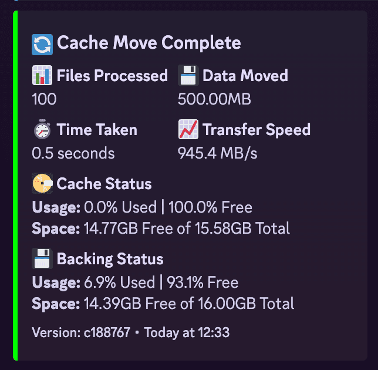

# mergerfs-cache-mover

# 🎉 v1.0 released with Docker support! - v1.1 released with Apprise support! 🎉

Python script for moving files on a cached disk to a backing mergerFS disk pool.

This was created as part of [MANS.](https://github.com/monstermuffin/muffins-awesome-nas-stack/)

## How It Works
The script operates by checking the disk usage of the defined 'cache' directory. If the usage is above the threshold percentage defined in the configuration file (`config.yml`), it will move the oldest files out to the backing storage location until the usage is below a defined target percentage. Empty directories are cleaned up after this operation.

The script uses a configuration file or environment variables in Docker to manage settings such as paths, thresholds, and system parameters. 

At runtime it will checks for other instances of itself to prevent multiple concurrent operations, in the event a move process is still occurring from a previous run either because you are using slow storage, running the script too regularly, or both.

## File Moving Process
This script now uses Python's built-in file operations instead of rsync:

  - `shutil.copy2()`: Copies files while preserving metadata.
  - `os.chmod()`: Explicitly sets file permissions to match the source.
  - `os.chown()`: Attempts to set file ownership to match the source.
  - `os.remove()`: Removes the source file after successful copy.

## Logging
The script logs its operations, which includes information on moved files, errors, and other warnings. The logs are rotated based on the file size and backup count defined in config.yml.

Docker logs are shown in console at runtime, and also as a file on the host if you bind mount, as below.

## Setup - Docker
Docker support was added in v1.0. The container will automatically run on a schedule defined in your configuration. This is a cron scedule.

### Quick Start
```yaml
services:
  cache-mover:
    image: ghcr.io/monstermuffin/mergerfs-cache-mover:latest
    container_name: mergerfs-cache-mover
    environment:
      # Required paths
      - CACHE_PATH=/mnt/cache-disks/cache01
      - BACKING_PATH=/mnt/media-cold
      # Optional settings with their default values
      - SCHEDULE=0 3 * * *  # Run at 3 AM daily
      - THRESHOLD_PERCENTAGE=70
      - TARGET_PERCENTAGE=25
      - MAX_WORKERS=8
      - MAX_LOG_SIZE_MB=100
      - BACKUP_COUNT=5
      - EXCLUDED_DIRS=temp,downloads,cache
      - NOTIFICATIONS_ENABLED=true
      - NOTIFICATION_URLS=discord://webhook_id/webhook_token,slack://hooks.slack.com/services/YOUR/SLACK/WEBHOOK
      - NOTIFY_THRESHOLD=true
    volumes:
      - /mnt/cache-disks:/mnt/cache-disks:rw
      - /mnt/media-cold:/mnt/media-cold:rw
      - ./logs:/var/log:rw  # Optional: Mount for persistent logs
    privileged: true
    restart: unless-stopped
```

### Configuration
The container can be configured through environment variables or by mounting a configuration file. All settings available in the 'traditional' setup are supported in Docker.

> [!NOTE]  
> Examples of using environment variables and using a config file are included in `docker-compose.yml`.

### Using Environment Variables
All configuration options can be set via environment variables:

- `CACHE_PATH`: Path to your cache directory (required)
- `BACKING_PATH`: Path to your backing storage (required)
- `SCHEDULE`: Cron expression for scheduling (default: "0 3 * * *")
- `THRESHOLD_PERCENTAGE`: Usage percentage that triggers moves (default: 70)
- `TARGET_PERCENTAGE`: Target usage percentage (default: 25)
- `MAX_WORKERS`: Maximum parallel file moves (default: 8)
- `MAX_LOG_SIZE_MB`: Maximum log file size (default: 100)
- `BACKUP_COUNT`: Number of log backups to keep (default: 5)
- `EXCLUDED_DIRS`: Comma-separated list of directories to exclude
- `NOTIFICATIONS_ENABLED`: Enables notifications (default false)
- `NOTIFICATION_URLS`: Apprise notification URLs
- `NOTIFY_THRESHOLD`: Notify on no action (default false)

### Using Config File
You can optionally mount your `config.yml` into the container as so:

```yaml
services:
  cache-mover:
    # ... other settings ...
    volumes:
      - ./config.yml:/app/config.yml:ro
```

### Manual Trigger
To manually trigger the cache mover via docker:

```bash
docker run --rm \
  --name cache-mover-test \
  --privileged \
  -v /mnt/cache-disks:/mnt/cache-disks:rw \
  -v /mnt/media-cold:/mnt/media-cold:rw \
  -e CACHE_PATH=/mnt/cache-disks/cache01 \
  -e BACKING_PATH=/mnt/media-cold \
  -e THRESHOLD_PERCENTAGE=0 \
  -e TARGET_PERCENTAGE=0 \
  ghcr.io/monstermuffin/mergerfs-cache-mover:latest \
  python cache-mover.py --console-log

# Or with a running container bypassing cron
docker exec mergerfs-cache-mover python cache-mover.py --console-log
```

### Important Notes
1. **Graceful Shutdown**: The container includes graceful shutdown handling. This ensures that any in-progress file moves complete safely when the container is stopped. If you try and quit the container forcefully during a move, you may face data corruption.

2. **Permissions**: The container requires privileged mode to access and modify file permissions correctly, same as the script method.

3. **Volume Mounts**: Ensure your volume mounts match the paths specified in your configuration.

4. **Auto-Update**: Auto-update is disabled by default in Docker to maintain container immutability. Use container image updates instead with something like [Watchtower](https://github.com/containrrr/watchtower) or [Duin](https://github.com/crazy-max/diun).

5. **Logging**: Container logs can be viewed with:
   ```bash
   docker logs mergerfs-cache-mover
   ```

### Troubleshooting
1. **Permission Issues**
   - Ensure the container is running in privileged mode
   - Verify the mounted volumes have correct permissions

2. **Schedule Not Working**
   - Check the SCHEDULE environment variable format
   - Verify the container is running (docker ps -a)
   - Check container logs for errors

3. **Files Not Moving**
   - Check excluded directories
   - Verify disk usage thresholds

## Setup - Bare Metal
1. To get started, clone the repository to your local machine using the following command:

```shell
git clone https://github.com/MonsterMuffin/mergerfs-cache-mover.git
```

2. Install the required Python packages using pip:

```shell
pip install -r requirements.txt
```

## Configuration Setup
Copy `config.example.yml` to `config.yml` and set up your `config.yml` with the appropriate values:

- `CACHE_PATH`: The path to your cache directory. !!THIS IS YOUR CACHE DISK ROOT, NOT MERGERFS CACHE MOUNT!!
- `BACKING_PATH`: The path to the backing storage where files will be moved.
- `LOG_PATH`: The path for the log file generated by the script.
- `AUTO_UPDATE`: Allows the script to update itself from GitHub on ever run.
- `THRESHOLD_PERCENTAGE`: The usage percentage of the cache directory that triggers the file-moving process.
- `TARGET_PERCENTAGE`: The target usage percentage to achieve after moving files.
- `MAX_WORKERS`: The maximum number of parallel file-moving operations.
- `MAX_LOG_SIZE_MB`: The maximum size for the log file before it's rotated.
- `BACKUP_COUNT`: The number of backup log files to maintain.
- `NOTIFICATIONS_ENABLED`: Enables notifications (default false)
- `NOTIFICATION_URLS`: Apprise notification URLs
- `NOTIFY_THRESHOLD`: Notify on no action (default false)

> [!WARNING]  
> This script must be run as root (using sudo) for the following reasons:

- File Permissions: Running as root ensures the script can read from and write to all directories, preserving original file permissions and ownership.
- Directory Creation: Root access is required to create directories with the correct permissions in the destination path.

## Notifications
As of v1.1 support for various notification methods through was added via the Apprise library. This includes detailed notifications for script completion, threshold alerts, and error states.

### Configuration
Notifications can be enabled through your `config.yml` or environment variables:

```yaml
Settings:
  NOTIFICATIONS_ENABLED: true
  NOTIFICATION_URLS:
    - 'discord://webhook_id/webhook_token'
    - 'slack://hooks.slack.com/services/YOUR/SLACK/WEBHOOK'
  NOTIFY_THRESHOLD: true  # Whether to notify when threshold is not met
```

Or via Docker environment variables:

```yaml
environment:
  - NOTIFICATIONS_ENABLED=true
  - NOTIFICATION_URLS=discord://webhook_id/webhook_token,slack://hooks.slack.com/services/YOUR/SLACK/WEBHOOK
  - NOTIFY_THRESHOLD=true
```

### Supported Services
Currently, the script provides rich formatting support for:
- **Discord**: Full embed support with detailed statistics
- **Slack**: Rich message formatting with detailed statistics

And basic support for:
- **Other Services**: Basic notification support through Apprise

To see how to configure your service, please see the [Approise docs.](https://github.com/caronc/apprise#productivity-based-notifications)

> [!NOTE]
> I have not tested anything but Discord/Slack webhooks at the time of writing. If you would like rich formatting for a specific service, feel free to raise an issue or PR.



### Threshold Notification
`NOTIFY_THRESHOLD` enables sending a notification when a run was started, but no action was taken due to `THRESHOLD_PERCENTAGE` not being reached. If this is not defined it is defaulted to `false`.


### Notification Types

1. **Completion Notification**
   - Sent when files are successfully moved
   - Includes:
     - Number of files processed
     - Total data moved
     - Operation duration
     - Transfer speed
     - Cache and backing storage status

2. **Threshold Not Met**
   - Sent when cache usage is below threshold
   - Includes:
     - Current cache usage
     - Threshold percentage
     - Cache and backing storage status

3. **Error Notification**
   - Sent when script encounters errors
   - Includes detailed error messages

### Service-Specific Setup

#### Slack
For Slack notifications, you'll need to create an incoming webhook. Use the full webhook URL:

```yaml
NOTIFICATION_URLS:
  - 'https://hooks.slack.com/services/T1234/B5678/abcdef123456'
```

> [!NOTE]  
> For Slack, format the webhook as in the `config.example.yml`.

#### Discord
For Discord notifications, use your webhook URL in this format:

```yaml
NOTIFICATION_URLS:
  - 'discord://webhook_id/webhook_token'
```

> [!NOTE]  
> Get your webhook URL from Discord Channel Settings → Integrations → Webhooks.

### Additional Services
For additional notification services and their configuration, refer to the [Apprise Documentation](https://github.com/caronc/apprise#productivity-based-notifications).

## Usage
To run the script manually, use the following command from your terminal:

```shell
sudo python3 cache-mover.py --console-log
```

You can also specify `--dry-run`

```shell
sudo python3 cache-mover.py --dry-run --console-log
```

Of course, this is meant to be run automatically....

## Automated Execution
Use either a `systemd` timer or Crontab entry. I have been moving from crontab to `systemd` timers myself, but you live your life how you see fit.

### Option 1: Systemd Timer
1. Create a `systemd` service file `/etc/systemd/system/cache_mover.service`. Change `/path/to/cache-mover.py` to where you downloaded the script, obviously.

```ini
[Unit]
Description="Muffin's Cache Mover Script."
After=network.target

[Service]
ExecStart=/usr/bin/python3 /opt/mergerfs-cache-mover/cache-mover.py
WorkingDirectory=/opt/mergerfs-cache-mover

[Install]
WantedBy=multi-user.targe
```

2. Create a systemd timer file `/etc/systemd/system/cache_mover.timer`. The timer format is not the usual crontab format, [find out more](https://silentlad.com/systemd-timers-oncalendar-(cron)-format-explained) if you need help.

```ini
[Unit]
Description="Runs Cache Mover Script Daily at 3AM."

[Timer]
OnCalendar=*-*-* 03:00:00
Persistent=true

[Install]
WantedBy=timers.target
```

3. Enable and start the timer:

```shell
systemctl enable cache_mover.timer
systemctl start cache_mover.timer
```

4. Check timer status:

```shell
systemctl list-timers
```

### Option 2: Crontab
1. Open crontab file for editing:

```shell
sudo crontab -e
```

2. Add line to run script. The following example will run the script daily, at 3AM. You can adjust this by using a site such as [crontab.guru.](https://crontab.guru/)
Change `/path/to/cache-mover.py` to where you downloaded the script, obviously.

```cron
0 3 * * * /usr/bin/python3 /path/to/cache-mover.py
```

## Special Features

### Empty Cache Mode
To completely empty the cache regardless of current usage and target percentage (except for excluded files), set both percentages to 0 either in ENV vars for docker or your `config.yml`.

```yaml
environment:
  - THRESHOLD_PERCENTAGE=0
  - TARGET_PERCENTAGE=0
```

```yml
Settings:
 # ... other settings ...
  THRESHOLD_PERCENTAGE: 0
  TARGET_PERCENTAGE: 0
```

### Auto-Update
I have now included an auto-update feature. At runtime, the script checks for updates from the GitHub repository and automatically updates itself if a new version is available.

Note: The auto-update feature is only available in versions after commit [b140b0c](https://github.com/monstermuffin/mergerfs-cache-mover/tree/b140b0c10cdc48506c96e2e23a1b8a2bef82109d). Any version before this commit will not have this feature.

## Change log

### v1.1
  - Apprise support added.

### v1.0
  - Added Docker support with scheduling and process management.
  - Added empty cache mode by setting both THRESHOLD_PERCENTAGE and TARGET_PERCENTAGE to 0.
  - Added hardcoded snapraid file/directory exclusions.
  - Added graceful shutdown handling for Docker containers.
  - Updated `load_config()` to handle Docker environment variable.
  - Added `docker-entrypoint.sh` for container scheduling.
  - Added Docker-specific process detection.
  - Added Docker environment variable configuration support.
  - Added Docker volume mount support for logs and configuration.
  - Added SCHEDULE option in config.yml (Docker-only).
  - Updated process detection for containerized environment.
  - Disabled auto-updates in Docker containers.
  - Enhanced logging for Docker operations.
  - Added Docker documentation.

### v0.98.7
 - Added a custom `HybridFormatter` class for more detailed logging of file move operations.
 - Implemented a new `set_git_dir()` function to set the Git directory environment variable.
 - Added support for specifying the update branch in the configuration (`UPDATE_BRANCH`).
 - Introduced excluded directories feature (`EXCLUDED_DIRS`in config). By default the `Snapraid` folder is excluded as there were instances of this being moved.
 - Added graceful shutdown handling using signal handlers (`SIGINT` and `SIGTERM`). This could possibly use more work to be honest.
 - Implemented free space checking before file moves.
 - Enhanced `auto_update()` function with better error handling and logging.
 - Refactored `move_file()` function for better error handling and logging.
 - Addressed potential race condition in checking filesystem usage with a lock mechanism. This should have cleared log spamming by the threads too. 
 - Added validation to ensure `THRESHOLD_PERCENTAGE` is greater than `TARGET_PERCENTAGE`.

 #### TODO:
 - Replace `os.walk()` with `os.scandir()`.

### v0.97
 - Re-added excluded dirs option. This is required as my Snapraid dir was moved with the content file. By default, the `snapraid` dir is now excluded. 
 - Fixed autoupdates not working when run automatically. 
 - Remove logging whilst gathering files as this was spamming the log and had no real use. 
 - Added check to ensure `THRESHOLD_PERCENTAGE` is greater than `TARGET_PERCENTAGE`.

### v0.96.5
 - Fixed child process detection

 ### v0.96
 - Fixed existing process detection


### v0.95
  - Fixed accidental directory collapse in backend pool upon directory manipulation
  - Replaced rsync with Python's built-in file operations for better control and compatibility
  - Added explicit permission and ownership preservation
  - Added --dry-run option for testing without file movement
  - "Improved" empty directory removal process
  - Enhanced logging


### v0.92
- Enhanced rsync command in move_file() function:
  - Added --preallocate option to improve performance and reduce fragmentation
  - Added --hard-links option to preserve hard links during file transfers
- Updated README to reflect new rsync options


### v0.91
- Simplified permission handling in the move_file() function
- Updated rsync command to use --perms option for explicit permission preservation
  - Now using --mkpath to resolve issues with base path not existing on destination
- Deprecated USER, GROUP, FILE_CHMOD, and DIR_CHMOD settings from config.yml
- Updated README

### v0.88
- Fixed auto-update functionality
  - Resolved issues when run via cron/systemd or outside script directory
  - Added AUTO_UPDATE configuration option to enable/disable auto-updates
- Improved script reliability
  - Added get_script_dir() function for consistent script directory detection
  - Modified get_current_commit_hash() to use the script's directory
  - Updated auto_update() function to use the script's directory for Git operations

### v0.83
- Added auto-update feature
  - The script now checks for updates from the GitHub repository
  - Automatically updates itself if a new version is available
- Improved logging
  - Added more detailed logging for the update process
- Code refactoring and optimization
  - Much tidier now my Python is slightly less shit, hopefully didn't break anything

### v0.7
- Initial release of the mergerfs-cache-mover script
- Basic functionality for moving files from cache to backing storage
- Configurable settings via config.yml
- Logging with rotation
- Support for both Systemd timer and Crontab scheduling

## Fin.
This has been working well for me, but always take care.
